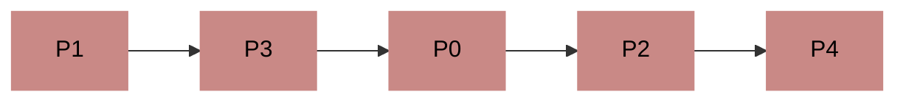
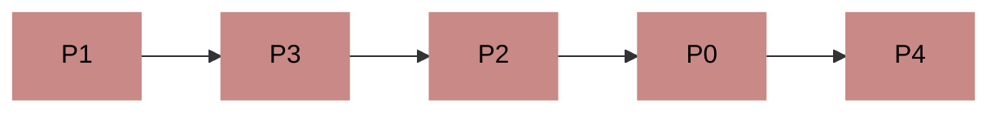

<p style="font-size: 0.85rem;"><i><sub>Content translated by <a href="https://www.deepseek.com/">DeepSeek</a>.</sub></i></p>

The Banker's Algorithm was first proposed by the computer science legend Edsger Dijkstra, aiming to solve the problem where a bank sometimes cannot lend money rationally.

Its core idea is that **the system predicts a resource allocation strategy before actually allocating resources, to avoid situations where allocated resources are less than the remaining resource demands.**

Before we start, we need to introduce a concept: the Safe Sequence.

## Safe Sequence

A safe sequence refers to a sequence of processes such that if the system allocates resources according to this sequence, each process can complete successfully.

This is the "predicted resource allocation strategy" mentioned earlier.

As long as we can find one safe sequence, the system is in a **safe state**. Conversely, if after a resource allocation, the system cannot find any safe sequence, then the system enters an **unsafe state**. A system in an unsafe state **might experience deadlock**.

Therefore, we need to predict whether a resource allocation request would lead the system into an unsafe state before granting it, to decide whether to approve the request.

So, how do we calculate this safe sequence?

## The Banker's Algorithm

Let's take an example 

> > Assume the system has 5 processes P0～P4 and 3 types of resources R0～R2. The initial quantities of these resources are (10, 5, 7). At a certain moment, the situation is:

| Process       | Max Need (Max) | Allocated (Allocation) | Still Needs (Need) |
| ------------- | -------------- | ---------------------- | ------------------ |
| P0            | (7, 5, 3)      | (0, 1, 0)              | (7, 4, 3)          |
| P1            | (3, 2, 2)      | (2, 0, 0)              | (1, 2, 2)          |
| P2            | (9, 0, 2)      | (3, 0, 2)              | (6, 0, 0)          |
| P3            | (2, 2, 2)      | (2, 1, 1)              | (0, 1, 1)          |
| P4            | (4, 3, 3)      | (0, 0, 2)              | (4, 3, 1)          |

In what order should we allocate resources to these processes to prevent deadlock?

First, we can calculate that at this moment, the remaining resources in the system are:

```
(10, 5, 7) - (0, 1, 0) - (2, 0, 0) - (3, 0, 2) - (2, 1, 1) - (0, 0, 2) = (3, 3, 2)
```

Next, we compare sequentially.

Clearly, allocating to P0 is not feasible. Its maximum required resources exceed the available resources. If we allocate all available resources to it, P0 still cannot complete its work, and no other process would get any resources.

Let's look at P1. The resources P1 needs (1, 2, 2) are less than the system's available resources (3, 3, 2). Therefore, the system can allocate resources to P1. Since P1 obtains all the resources it needs, it can definitely complete its task smoothly and release the resources.

So, if we allocate resources to P1, after P1 finishes running, the resources we can control become:

```
(3, 3, 2) + (2, 0, 0) = (5, 3, 2)
```

Following this logic, we continue searching.

P2 needs some resources that exceed what we hold, so we skip it for now.

P3 needs resources less than what we hold, so we can allocate resources to P3. After P3 finishes, the system reclaims the resources held by P3. At this point, the free resources become:

```
(5, 3, 2) + (2, 1, 1) = (7, 4, 3)
```

Now, the system's free resources are all greater than or equal to what the remaining processes need. We simply need to allocate resources to P0, P2, and P4 in sequence and reclaim them afterwards.

Thus, we have successfully obtained a safe sequence:



Of course, if you want to change it to:



Or any other order, it doesn't matter, because **there can be multiple safe sequences**. 