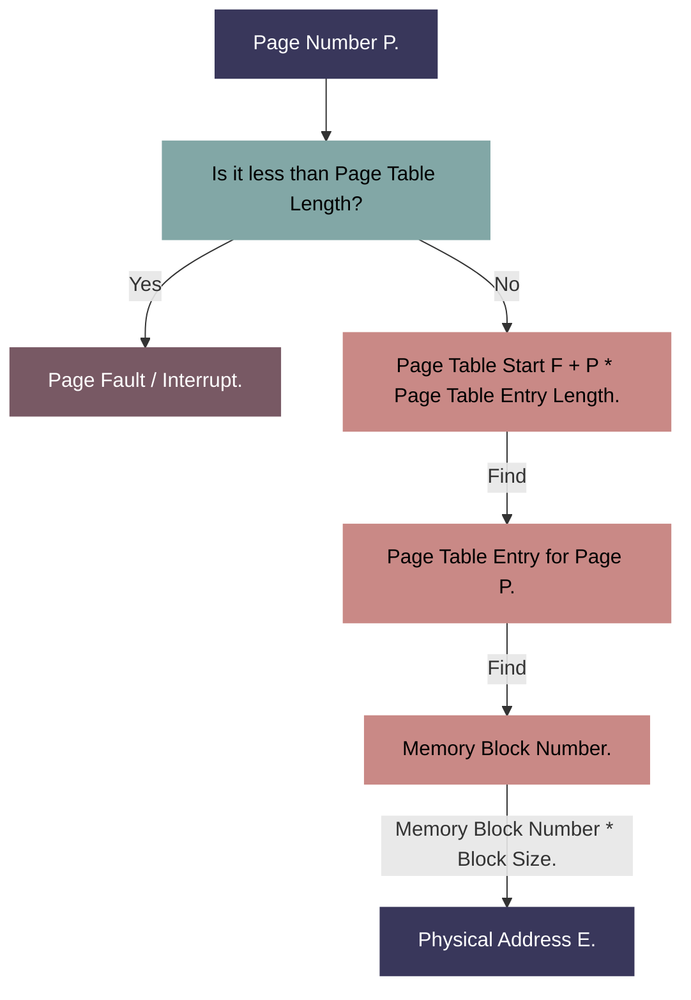

<i>Content translated by <a href="https://www.deepseek.com/">DeepSeek</a>.</i>

We know that early operating systems used methods like partition allocation to manage memory, but these methods had a common problem: they couldn't fully utilize memory space, easily creating a large number of tiny, hard-to-use memory fragments, and performance was poor.

So, people came up with a better memory management scheme, namely:

# Paged Memory Management

How is paged memory management implemented?

First, we divide the physical memory into partitions of equal size, called **frames (or memory blocks)**. Each frame has a **frame number (or memory block number)**. Frame numbers **start from 0**.

We know that processes use logical addresses when running (which is more efficient). Therefore, we can also **divide the logical address space of a process into parts of equal size to the frames**.

The partitions divided from the logical address are called **pages**. Each page is numbered with a **page number**. Page numbers also **start from 0**.

Pages and frames have a one-to-one correspondence.

To know which memory block each page corresponds to, the operating system also needs to create a **page table**.

> 1. Each process corresponds to one page table.
>
> 2. Each page of the process corresponds to one page table entry.
>
> 3. Each **page table entry** consists of a page number and a block number.
>
> 4. The page table records the **mapping relationship** between a process's **pages** and the actual **memory blocks** where they are stored.

**Note:** What is stored in the page table is the **memory block number**, not the starting address of the memory block.

Let's summarize.

- **Frame:** A block divided in physical memory (equal size).
- **Page:** A block divided from the logical address (corresponds one-to-one with frames in memory, also equal size).
- **Page Table:** Used to record the location of pages in physical memory. (The page table stores the **number** of the frame/memory block, not the address.)

## Address Translation

At this point, if the operating system wants to access a logical address A in a process, it needs to:

1️⃣ Determine the page number P corresponding to logical address A.

2️⃣ Query the page table to find the starting address of page P in memory.

3️⃣ Determine the page offset W within logical address A.

In other words:

Physical address corresponding to logical address A = Starting address of page P in memory + Page offset W

> Page number = Logical address / Page size  
> Page offset = Logical address % Page size

At this point, the operating system should be able to use memory more efficiently. But, boss, you've added a page table as an intermediary. The method of finding the actual address by multiplying the memory block number stored in the page table by the block size is efficient, but is there a method that's even more efficient and less time-complexity heavy?

Yes, bro, yes. It's...

## Basic Address Translation Mechanism

In more modern operating systems, a **Page Table Register (PTR)** is usually set up. In the PTR, we store the **starting address F** of the page table in memory and the **page table length M**. (The page table is stored contiguously in memory.)

When a process is not executing, **its starting address and length are stored in its PCB**.

When the process is scheduled, the kernel loads them into the page table register.

Here's the flowchart:

In other words, when the operating system wants to access an address, it needs to:

1️⃣ Find the page number P from the logical address A and check if P is less than the total length of the page table.

2️⃣ Find the page table start address F from the page table register PTR, and use **page number P \* page table entry length M + start address F** to get the **page table entry** corresponding to page P.

3️⃣ We know the page table entry stores the **memory block number**. Now we just need to multiply the memory block number by the block size to find the physical address E 🎉

> **Note:**
>
> - **Page table length** is the total number of entries in the page table.
>
> - **Page table entry length** is the **storage space size** occupied by a single page table entry.

Looks simple? This method **of storing the page table location in a register, calculating the location of the page table entry in memory to retrieve the memory block number, and then calculating the physical address from the block number** is happening in computers worldwide, and you could be the next one. Unless...

You make the most important decision of your life! That is, adopt the continuous allocation management method!

Allocate contiguous memory space for user processes! Use partition allocation with fitting algorithms!

Become a master of fragment cleanup.

Now let's take an example to solidify our understanding 🌰

> If the page size L is 1K bytes, the memory block number b corresponding to page number 2 is 8, convert the logical address A=2500 to a physical address E.

In plain English: In the operating system, a page/frame size is 1K, i.e., 1024 bytes. In the page table, the page table entry for page number 2 stores memory block number 8. Now we need to convert the byte at logical address 2500 to a physical address.

1️⃣ Calculate the page number and page offset (i.e., the distance of this address from the start of the page within a single page).

**Page number P = A / L = 2500 / 1024 = 2**, meaning A is within the second page in the logical address space.

2️⃣ Find the memory block corresponding to this page and calculate the physical address.

It was mentioned earlier that page number 2 corresponds to memory block number 8. So we can calculate the actual starting address of this page as:

**b \* L = 8 \* 1024 = 8192**

Then the physical address E is the memory block address plus the offset:

**E = b \* L + W = 8 \* 1024 + 452 = 8644** 