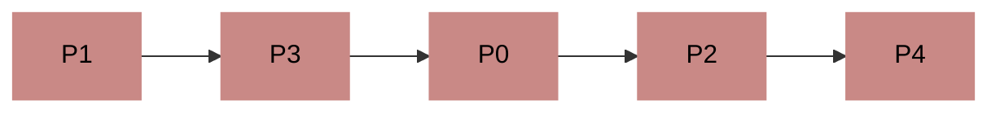
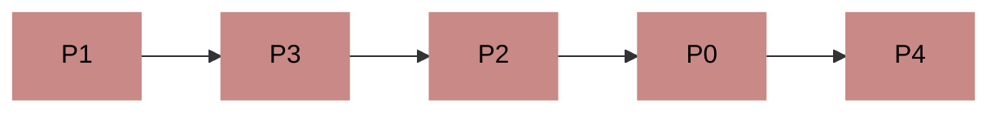

银行家算法最早由计算机原神迪杰斯特拉提出，目的是解决银行有时无法将钱合理借出的问题。

它的核心思路是，**系统在分配资源前提前预测出一种分配方式，以避免分配后资源少于剩余资源需求的情况。**

在开始之前我们需要引入一个概念：安全序列。

## 安全序列

安全序列是指，如果系统按照这种序列分配资源，则每个进程都能顺利完成。

也就是前面提到的“系统预测出的资源分配方式”。

只要我们找出一个安全序列，系统就是安全状态，相反，如果在某一次资源分配后，系统找不到安全序列，那系统就进入了**不安全状态**，在不安全状态下的系统**有可能会发生死锁**。

因此，我们需要在资源分配前先预测这次分配是否会导致系统进入不安全状态，以此决定是否答应资源分配请求。

那么如何计算出这个安全序列呢？

## 银行家算法

举个栗子🌰

> > 假设系统中有5个进程P0～P4，有3种资源R0～R2，这三种资源初始量为(10, 5, 7)，在某一时刻的情况为

| 进程(Process) | 最大需求(Max) | 已分配(Allocation) | 最多还需要(Need) |
| ------------- | ------------- | ------------------ | ---------------- |
| P0            | (7, 5, 3)     | (0, 1, 0)          | (7, 4, 3)        |
| P1            | (3, 2, 2)     | (2, 0, 0)          | (1, 2, 2)        |
| P2            | (9, 0, 2)     | (3, 0, 2)          | (6, 0, 0)        |
| P3            | (2, 2, 2)     | (2, 1, 1)          | (0, 1, 1)        |
| P4            | (4, 3, 3)     | (0, 0, 2)          | (4, 3, 1)        |

那我们应该按照什么顺序来分配资源给这些进程，以防止进程死锁？

首先我们可以计算出，在当前时刻，系统中剩余的资源为

```
(10, 5, 7) - (0, 1, 0) - (2, 0, 0) - (3, 0, 2) - (2, 1, 1) - (0, 0, 2) = (3, 3, 2)
```

接下来我们依次比较。

很显然，分配给P0是不可行的，它最多需要的资源超出了已有资源，如果将已有资源全部分配给它，那么P0还是无法完成它的工作，而且其他进程都别想获得资源了。

我们再来看P1，P1所需要的资源(1, 2, 2)要少于系统已有的资源(3, 3, 2)，那么系统是可以把资源分配给P1的，既然P1获得了它所需要的全部资源，它肯定可以顺利地完成它的任务并将资源释放。

所以如果我们把资源分配给了P1，待P1运行完成后，我们可支配的资源就变成了

```
(3, 3, 2) + (2, 0, 0) = (5, 3, 2)
```

顺着这个思路我们继续找。

P2需要的某些资源数超出了我们持有的资源，那我们先跳过。

P3需要的资源小于我们持有的，那我们可以把资源分配给P3，待P3运行结束后，系统回收P3占用的资源，此时空闲资源为

```
(5, 3, 2) + (2, 1, 1) = (7, 4, 3)
```

此时，系统的空闲资源均以大于等于剩下进程需要的资源，我们只需要将资源依次分配给P0、P2、P4并回收就行。

这样，我们就成功得到了一个安全序列



当然如果你想把它改成



或者其他的也无所谓，因为**安全序列可能有多个**。