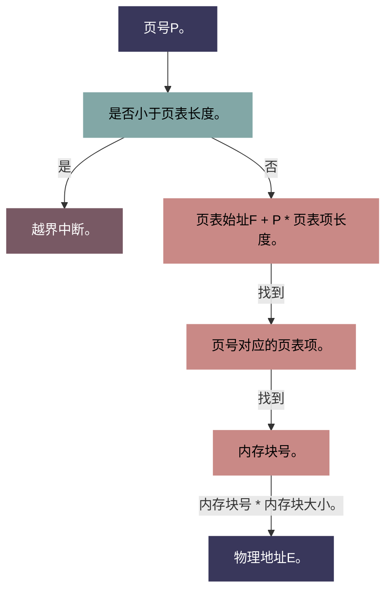

我们知道，曾经的操作系统曾使用过分区分配等方法管理内存，但这些方法都存在一个普遍的问题：无法完全利用好内存空间，容易产生大量的难以利用的微小内存碎片，且性能较差。

于是人们想出了一个更好的内存管理方案，即

# 分页储存管理

分页储存管理是怎么实现的呢？

首先，我们将内存划分为一个个大小相等的分区，成为**页框（内存块）**。每个页框有一个**页框号（内存块号）**。页框号**从0开始计算**。

我们知道进程运行时是使用逻辑地址（这样更高效），于是我们可以把进程的逻辑地址空间也**划分为与页框大小相等的一个个部分**。

逻辑地址划分出来的一个个分区叫做**页面**，每个页面以**页号**为编号。页号也是**从0开始计算**。

页面和页框有一一对应关系。

为了能知道每个页面对应的是哪个内存块，操作系统还要建立一个**页表**。

> 1. 每个进程对应一张页表
> 
> 3. 进程的每个页面对应一个页表项
> 
> 5. 每个**页表项**由页号和块号组成
> 
> 7. 页表记录进程**页面**和实际存放的**内存块**之间的**映射关系**

**注意：**页表中存储的是**内存块号**，而不是内存块的起始地址。

我们来梳理一下。

- **页框：**是内存上划分的区块（大小相等）

- **页面：**是逻辑地址划分出来的区块（和内存上划分出的页框一一对应，大小也相等）

- **页表：**用来记录页面在内存上的位置。（页表中存的是页框即内存块的**编号**，而非地址）

## 地址转换

此时，若操作系统想要访问某次进程中的逻辑地址A，它需要：

1️⃣ 确定逻辑地址A对应的页号P

2️⃣ 查询页表，找到P号页面在内存中的起始地址

3️⃣ 确定逻辑地址A的页内偏移量W

也就是说

逻辑地址A对应的物理地址 = P号页面在内存中的起始地址 + 页内偏移量W

> 页号 = 逻辑地址 / 页面长度  
> 页内偏移量 = 逻辑地址 % 页面长度

到这一点了，操作系统应当可以更高校地利用内存了，那么主包主包，你这加了个页表作为中转，通过页表中存的内存块号乘内存块大小找到实际地址的方法固然很高效，那有没有什么更高效而且更不吃时间复杂度的方法呀。

有的兄弟，有的。他就是……

## 基本地址变换机构

更现代的操作系统中，通常会设置一个**页表寄存器PTR**。在PTR中我们存放页表在内存中的**起始地址F**和**页面长度M**。（页表在内存中连续存放）

在进程未执行时，**起始地址和长度放在PCB中**。

当进程被调度时，内核会把他们放到页表寄存器中。

上流程图：

也就说，当操作系统想要访问某个地址时，它要：

1️⃣ 通过逻辑地址A找到页号P，并检查P是否小于页表的总长度。

2️⃣ 从页表寄存器PTR中找到页表的始址F，用**页号P \* 页表项长度M+始址F**得到页号对应的**页表项**。

3️⃣ 我们知道页表项中存的是**内存块号**。现在只需要用内存块编号 \* 内存块大小就能找到物理地址E🎉

> **注意：**
> 
> - **页表长度**是页表中总共有多少项
> 
> - **页表项长度**是单个页表项所占的**储存空间大小**

看起来很简单？像这样**在寄存器中存下页表位置，并通过算出页表项在内存中的位置取出内存块号，再通过内存块号算出物理地址的方式**正在全球的电脑中发生，而你可能是下一个。除非……

你能做出这被子最重要的决定！那就是，采用连续分配管理方式！

为用户进程分配连续的内存空间！使用分区分配，通过适应算法！

成为碎片清理大师。

  

那我们举个栗子来巩固下印象🌰

> 若页面大小L为1K字节，页号2对应的内存块号b=8，请将逻辑地址A=2500转换为物理地址E。

说人话就是：操作系统中，一个页面/内存块的大小为1k，即1024个字节，页表中，页号为2的页表项中存储的内存块号为8，现在需要我们把位于逻辑地址中的第2500字节转换为物理地址。

1️⃣ 计算页号和页内偏移量（即这个地址在单个页面内离页面开始的距离）

**页号P = A / L = 2500 / 1024 = 2**，即A在逻辑地址中第二个页面内。

2️⃣ 找出该页面对应的内存块，并算出物理地址

前面已经提到了页号为2的页面对应内存块号为8的内存块。那我们便可以算出这个页面的实际地址为

**b \* L = 8 \* 1024 = 8192**

那么物理地址E就是内存块地址加上偏移量

**E = b \* L + W = 8 \* 1024 + 425 = 8644**
